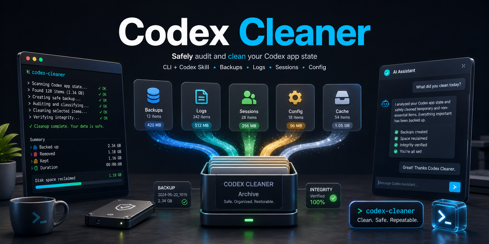

# Codex Cleaner




**A safer reset button for local Codex clutter. Built for people who live in Codex every day.**

Codex Cleaner audits your local Codex Desktop and Codex CLI state, explains what is taking up space, and helps you archive old chats, rotate logs, prune stale project shortcuts, and move old worktrees without permanently deleting your history.

It works two ways:

- **As a one-time CLI:** run it from any terminal with `npx`.
- **As a Codex-native skill:** install `$codex-cleaner`, then manage cleanup from inside a Codex chat.

```bash
npx --yes --package github:hapwi/codex-cleaner codex-cleaner
```

## Why People Use It

Codex can accumulate a lot of local state: active chats, archived sessions, log databases, temporary worktrees, and saved project config. Codex Cleaner turns that hidden state into a clear menu.

No guessing. No manual digging through `~/.codex`. No risky delete commands.

## Highlights

- **Instant audit:** see active chats, archived sessions, pinned threads, log size, stale config, and old worktrees.
- **Guided cleanup:** get a plain-English menu instead of a raw diagnostic dump.
- **Backup-first actions:** state-changing cleanup writes backups and manifests before moving anything.
- **Codex-native workflow:** invoke `$codex-cleaner`, review the menu in chat, approve only the action you want.
- **No permanent deletes:** archive and rotate by default; clearing archives is intentionally separate.

## Quick Start

Run the bootstrap command:

```bash
npx --yes --package github:hapwi/codex-cleaner codex-cleaner
```

On first run, Codex Cleaner checks for the `$codex-cleaner` skill at:

```text
~/.agents/skills/codex-cleaner
```

If the skill is missing, it asks before installing it. After that, start a new Codex chat and invoke:

```text
$codex-cleaner
```

If the skill is already installed but the bundled GitHub version is newer, the bootstrap command prompts before replacing the local skill file.

## What It Cleans

| Area | What Codex Cleaner Does | Safety Guard |
|---|---|---|
| Active chats | Archives old or all non-pinned active chats | Pinned chats are never archived |
| Sessions | Moves matching session files into archive storage | Restore manifests are written before cleanup |
| Logs | Rotates `logs_2.sqlite` into archived logs | Waits until the log DB is free |
| Project config | Removes saved entries for missing/temp folders | Does not delete project files |
| Worktrees | Moves stale Codex worktrees out of the active folder | Does not touch normal project folders |

## Terminal Commands

Read-only audit:

```bash
npx --yes --package github:hapwi/codex-cleaner codex-cleaner audit
```

Cleanup commands:

```bash
npx --yes --package github:hapwi/codex-cleaner codex-cleaner archive-old-chats --days 10
npx --yes --package github:hapwi/codex-cleaner codex-cleaner archive-all-chats
npx --yes --package github:hapwi/codex-cleaner codex-cleaner prune-stale-projects
npx --yes --package github:hapwi/codex-cleaner codex-cleaner rotate-logs
npx --yes --package github:hapwi/codex-cleaner codex-cleaner archive-stale-worktrees --days 7
```

Structured output for Codex agents:

```bash
npx --yes --package github:hapwi/codex-cleaner codex-cleaner audit --json
```

Version/status checks:

```bash
npx --yes --package github:hapwi/codex-cleaner codex-cleaner version
npx --yes --package github:hapwi/codex-cleaner codex-cleaner skill-status
```

## Codex Skill Flow

The bundled `$codex-cleaner` skill keeps the chat experience simple:

```text
User invokes $codex-cleaner
  -> Codex runs the npx audit command
  -> Codex explains the cleanup menu in chat
  -> User picks an action
  -> Codex runs only the approved cleanup command
```

The skill is intentionally thin. The CLI is the source of truth, so terminal users and Codex users get the same cleanup behavior.

Every CLI run reports the CLI version and skill version. JSON mode includes the same data under `version`, so the Codex skill can show the exact version it used at the bottom of its chat response.

## Safety First

Codex Cleaner is designed around boring, reversible operations:

- Audit mode is read-only by default.
- Cleanup requires an explicit command or user approval.
- Backups are created before state-changing actions.
- Pinned chats are protected.
- Recent chats are protected during age-based cleanup.
- Log contents are treated as private.
- Archives are not automatically deleted.

## Install Only The Skill

From a local checkout:

```bash
node ./bin/codex-cleaner.js install-skill
```

Or after publishing/pushing:

```bash
npx --yes --package github:hapwi/codex-cleaner codex-cleaner install-skill
```

## Development

```bash
npm run audit
node ./bin/codex-cleaner.js skill-status
node ./bin/codex-cleaner.js install-skill
npm pack --dry-run
```

## License

MIT
